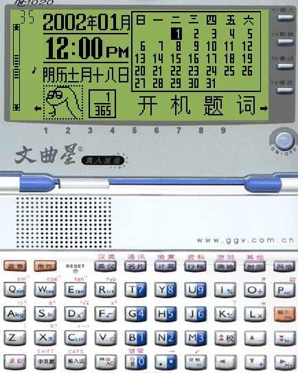

# js版文曲星nc1020模拟器
## 网页版文曲星nc1020[模拟器](https://leoncoolmoon.github.io/jswqx/)  

从原基础上修改增加了图形界面 
 
orginal: http://bbs.emsky.net/viewthread.php?tid=33474 
目前只在chrome浏览器测试过，别的浏览器应该也有能跑的。 
若想要离线使用可以安装python，通过python构建的小型本地服务器运行。比如本项目集成的start.py 
2018.09.11 Dr.Quest优化版，压缩ROM到10M ZIP文件，添加了手机触摸屏支持 
2023.12.24 leoncoolmoon 修改了UI 增加ctrl为跳出键 
2026.05.17 leoncoolmoon 修复了flash存储，可以在浏览器内永久化保存 
